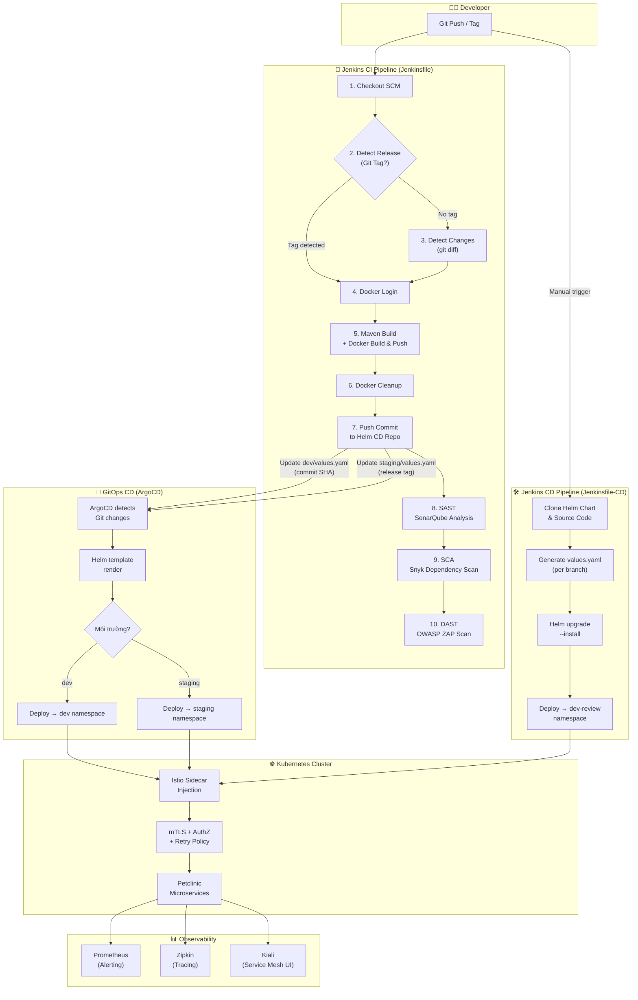
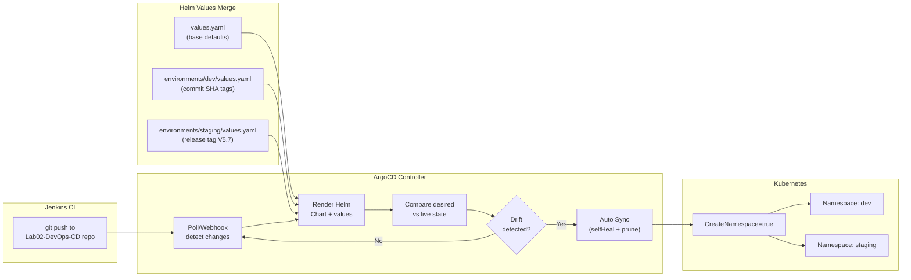
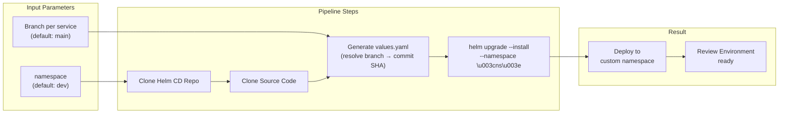
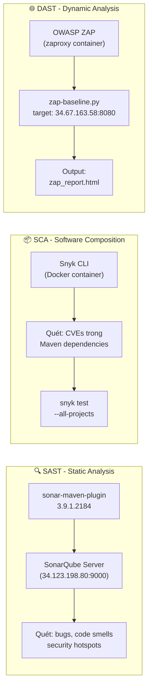
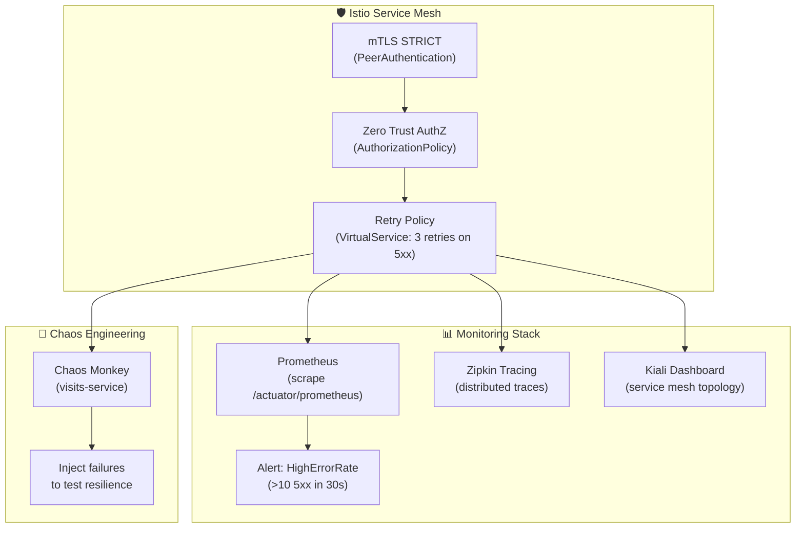
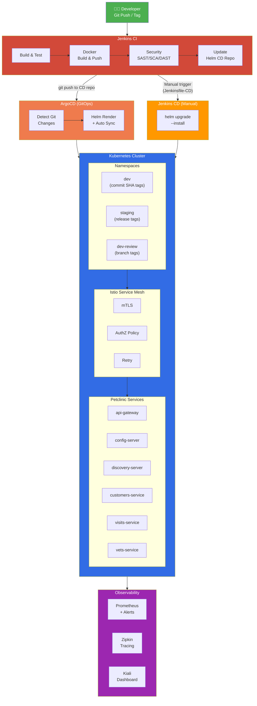

# Sơ đồ Pipeline CI/CD hoàn chỉnh — Spring Petclinic Microservices

## Tổng quan kiến trúc

Dự án sử dụng **3 pipeline** phối hợp với nhau:

| Pipeline | File | Mục đích |
|---|---|---|
| **CI Pipeline** (Jenkinsfile) | [Jenkinsfile](file:///d:/University/Year%204/Semester%201/Advanced%20Devops/Lab/lab02/Lab02-DevOps/Jenkinsfile) | Build, scan bảo mật, đóng Docker image, push trigger CD |
| **CD Manual Pipeline** (Jenkinsfile-CD) | [Jenkinsfile-CD](file:///d:/University/Year%204/Semester%201/Advanced%20Devops/Lab/lab02/Lab02-DevOps/Jenkinsfile-CD) | Deploy thủ công qua Helm cho môi trường dev-review |
| **GitOps CD** (ArgoCD) | [argocd-apps/](file:///d:/University/Year%204/Semester%201/Advanced%20Devops/Lab/lab02/Lab02-DevOps-CD/argocd-apps) | Tự động sync từ Git repo CD → Kubernetes |

---

## 1. Sơ đồ tổng thể CI/CD



---

## 2. Chi tiết CI Pipeline (Jenkinsfile)

```mermaid
flowchart LR
    subgraph TRIGGER["Trigger"]
        T1["Push to main"]
        T2["Git Tag\n(Release)"]
        T3["Push to\nfeature branch"]
    end

    subgraph BUILD["Build Phase"]
        B1["Checkout SCM\n+ fetch tags"]
        B2{"Release Tag\ndetected?"}
        B3["Detect Changed\nServices\n(git diff)"]
        B4["Build ALL\nservices"]
        B5["Build CHANGED\nservices only"]
    end

    subgraph DOCKER["Docker Phase"]
        D1["Docker Login\n(credentials)"]
        D2["Maven clean install\n-DskipTests"]
        D3["Docker Build\n(multi-stage)"]
        D4["Docker Push\n(tag: commit SHA)"]
        D5["Docker Push\n(tag: latest)"]
        D6["Docker Push\n(tag: release)"]
        D7["Docker Cleanup\n+ Logout"]
    end

    subgraph SECURITY["DevSecOps Phase"]
        S1["SAST: SonarQube\n(sonar-maven-plugin)"]
        S2["SCA: Snyk\n(Docker container)"]
        S3["DAST: OWASP ZAP\n(baseline scan)"]
    end

    subgraph CD_TRIGGER["CD Trigger"]
        C1["Clone Helm CD Repo"]
        C2{"Tag or Main?"}
        C3["Update dev/values.yaml\n(per-service commit SHA)"]
        C4["Update staging/values.yaml\n(release tag cho ALL)"]
        C5["Bump Chart.yaml\nversion"]
        C6["Git push\nto CD repo"]
    end

    T1 --> B1
    T2 --> B1
    T3 --> B1
    B1 --> B2
    B2 -->|"Yes"| B4
    B2 -->|"No"| B3
    B3 --> B5

    B4 --> D1
    B5 --> D1
    D1 --> D2 --> D3 --> D4
    D4 -->|"main branch"| D5
    D4 -->|"release tag"| D6
    D4 --> D7

    D7 --> C1
    C1 --> C5
    C5 --> C2
    C2 -->|"main"| C3
    C2 -->|"tag"| C4
    C3 --> C6
    C4 --> C6

    D7 --> S1 --> S2 --> S3
```



### Chiến lược Image Tagging

| Trigger | Image Tag | Môi trường target | Services được build |
|---|---|---|---|
| Push to `main` | `<commit-SHA>` + `latest` | **dev** | Chỉ service có thay đổi |
| Git Tag (vd: `V5.7`) | `<tag-name>` | **staging** | Tất cả 6 services |
| Feature branch | `<commit-SHA>` | **dev-review** (manual) | Chỉ service có thay đổi |

---

## 3. Chi tiết CD — GitOps Flow (ArgoCD)



> [!IMPORTANT]
> ArgoCD được cấu hình **automated sync** với `selfHeal: true` và `prune: true`. Điều này nghĩa là:
> - Mọi thay đổi trên Git sẽ **tự động deploy** mà không cần phê duyệt
> - Nếu ai đó sửa trực tiếp trên cluster (kubectl edit), ArgoCD sẽ **tự revert** về trạng thái Git
> - Resources thừa (không còn trong Git) sẽ bị **tự động xóa**

---

## 4. Chi tiết CD — Manual Pipeline (Jenkinsfile-CD)



> [!NOTE]
> Pipeline này cho phép deploy **bất kỳ branch nào** của từng service riêng biệt vào một namespace tùy chọn. Hữu ích cho **review environment** khi cần test feature branch trước khi merge.

---

## 5. Bảo mật trong Pipeline (DevSecOps)



---

## 6. Runtime Security & Observability (Post-Deploy)



---

## 7. Sơ đồ End-to-End hoàn chỉnh



---

## Tóm tắt luồng hoạt động

### Flow 1: Development → Dev (Tự động)
```
Developer push code → Jenkins CI detect changed services → Maven build → Docker build & push (tag: commit SHA)
→ Clone CD repo → Update environments/dev/values.yaml (per-service tag) → Bump Chart version → Git push
→ ArgoCD auto-sync → Deploy to dev namespace
```

### Flow 2: Release → Staging (Tự động)
```
Developer tạo Git tag (vd: V5.7) → Jenkins CI build ALL services → Docker build & push (tag: V5.7)
→ Clone CD repo → Update environments/staging/values.yaml (all services = V5.7) → Git push
→ ArgoCD auto-sync → Deploy to staging namespace
```

### Flow 3: Feature Review → Dev-review (Thủ công)
```
Developer trigger Jenkinsfile-CD → Chọn branch per service + namespace
→ Clone source code → Resolve branch → commit SHA → Generate values.yaml
→ Helm upgrade --install → Deploy to custom namespace
```

### Security Pipeline (Chạy song song/sau build)
```
SonarQube (SAST) → Snyk (SCA) → OWASP ZAP (DAST) → Reports archived in Jenkins
```
